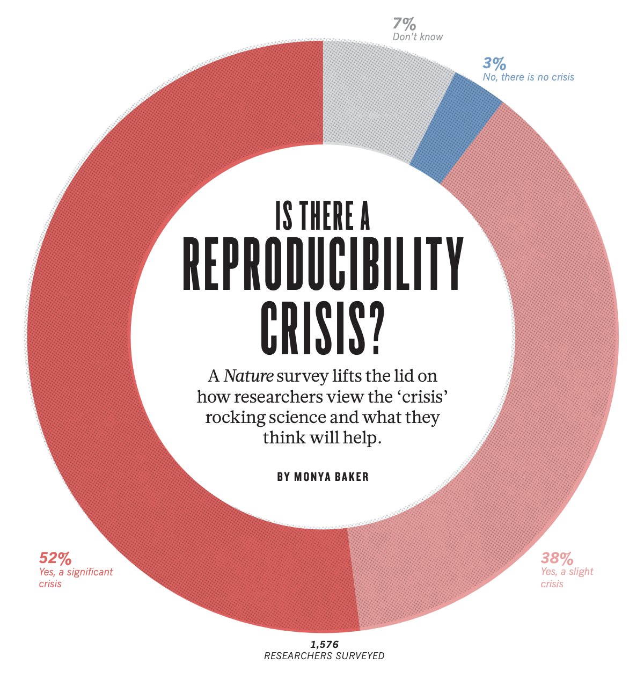

```{r setup, include=FALSE}
options(htmltools.dir.version = FALSE)
knitr::opts_chunk$set(warning = FALSE, message = FALSE, 
  comment = NA, dpi = 300,
  fig.align = "center", out.width = "80%", cache = FALSE)

if(!require('tidyverse')) {
	install.packages('tidyverse')
}
if(!require('devtools')) {
	install.packages('devtools') 
}
if(!require('emo')) {
	devtools::install_github("hadley/emo")
}
if(!require('xaringanExtra')) {
	devtools::install_github("gadenbuie/xaringanExtra")
}
if(!require('countdown')) {
	devtools::install_github("gadenbuie/countdown")
}
```

## The reproducibility crisis

```{r out.width = '65%', echo = FALSE}

```

.footnote[`r emo::ji("link")` [1,500 scientists lift the lid on reproducibility | Monya Baker](https://www.nature.com/articles/533452a)]

---

## The reproducibility crisis

```{r out.width = '40%', echo = FALSE}

```

> "**More than 70%** of researchers have tried and failed to reproduce another scientist's experiments, and **more than half** have failed to reproduce their own experiments." 

.footnote[`r emo::ji("link")` [1,500 scientists lift the lid on reproducibility | Monya Baker](https://www.nature.com/articles/533452a)]

---

## The reproducibility crisis

.pull-left[

* Attempted to replicate 100 published studies based on the original materials using high powered designs

* The mean replication effect size was **half the magnitude** (*M* = 0.20, *SD* = 0.26)

* **36%** of replication results were statistically significant (versus 97% of the original studies)

* **39%** of the replications were subjectively rated as replicating the original result
]

.pull-right[
```{r out.width = '100%', echo = FALSE}
knitr::include_graphics("imgs/replication_OSC.jpeg")
```
]

.footnote[`r emo::ji("link")` [Estimating the reproducibility of psychological science | Open Science Collaboration](https://www.science.org/doi/10.1126/science.aac4716)]


---

## Reproducibility versus replicability

--

**Reproducibility**

* Can a research finding be verified from the same data and code?

--

* Same research question, **same** data, *hopefully* the same results

--

**Replicability**

* Can a research finding be confirmed using the same methods, protocols and equipment?

--

* Same research question, **new** data, *hopefully* the same results

.footnote[Content adapted from [Reproducible Research Introduction from Data Carpentry](https://datacarpentry.org/rr-intro/01-introduction/index.html)]

---

## Why does it matter?
```{r why, echo=FALSE}
xaringanExtra::use_editable(expires = 1)
```

.pull-left[
  For society
  .can-edit.key-likes[
  - 
  ]
]

.pull-right[
  For ourselves
  .can-edit.key-likes[
  - 
  ]
]

---

## Reproducible workflows

--

* The whole project: from design to publication and dissemination 

--

.footnote[Content adapted from [Reproducible Research Introduction from Data Carpentry](https://datacarpentry.org/rr-intro/01-introduction/index.html)]
  
* Facets of reproducibility:

  * **Documentation**: it's clear what happened and why; e.g. code is available and commented

--

  * **Organization**: it's clear where everything can be found; e.g. consistent file structures and naming conventions 

--

  * **Automation**: it's simple to reproduce processes; e.g. an analysis script can be executed to produce the same results

--

  * **Dissemination**: it's possible for others to reproduce your work; e.g. materials, code, and data (if possible) are publicly shared

---

## Reproducible workflows

```{r errors, echo=FALSE}
xaringanExtra::use_editable(expires = 1)
```

Reflect on your current workflow 

--

.pull-left[
  Less reproducible
  .can-edit.key-likes[
  - 
  ]
]

.pull-right[
  More reproducible
  .can-edit.key-likes[
  - 
  ]
]

---

## Reproducible reporting with R Markdown
### Project example

```{r echo=FALSE, out.width=750}
knitr::include_url("https://cnlab.github.io/self-social-sharing/")
```

`r emo::ji("link")` [Project repository on GitHub](https://github.com/cnlab/self-social-sharing) | [OSF project page](https://osf.io/bgs5y/)

---

## Reproducible report walk through

```{r echo=FALSE, out.width=750}
knitr::include_url("https://dcosme.github.io/reproducibility-workshop/")
```

`r emo::ji("link")` [Workshop repository on GitHub](https://dcosme.github.io/reproducibility-workshop)

---

## Extensions

--

* Version control using [`git`](https://git-scm.com/) and [`github`](https://github.com/)

--

* Static website hosting with [`github`](https://pages.github.com/)

--

* [Manuscript production using R Markdown](https://osf.io/q395s)

--

* Interactive data visualization and communication using [`{shiny}`](https://shinyapps.io/)

---
class: center, middle

# Thank you!

<br>

### Workshop materials are available at: [github.com/dcosme/reproducibility-workshop](https://github.com/dcosme/reproducibility-workshop)

